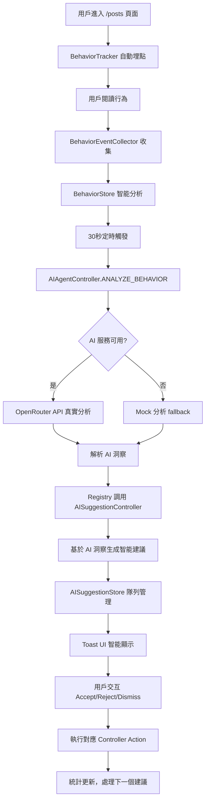

# AI Behavior Assistant - Implementation Status & Testing Guide

## 🎉 當前狀況 - 2025.01.24 - 系統完全就緒！

**✅ 已完成 100%** - 所有核心組件已實現、架構重構完成、系統自動啟動

## 🚀 **完整實現狀況**

### **🎯 核心組件實現狀況**

| 組件 | 狀態 | 說明 |
|------|------|------|
| **AIAgentService** | ✅ 完成 | 真正調用 OpenRouter API，移除強制 mock |
| **AIAgentController** | ✅ 完成 | 專注行為分析，通過 Registry 調用建議生成 |
| **AISuggestionController** | ✅ 完成 | 智能建議生成，無狀態架構，隊列協調 |
| **AISuggestionStore** | ✅ 完成 | Zustand 狀態管理，隊列、統計、優化 |
| **BehaviorEventCollector** | ✅ 完成 | 統一事件收集，支援過濾和格式化 |
| **BehaviorTracker** | ✅ 完成 | 已在 `/posts` 和 `/posts/[id]` 正確埋點 |
| **IntervalManager** | ✅ 完成 | 簡化的定時任務管理，移除過度設計 |
| **AI Toast UI** | ✅ 完成 | 智能顯示時長，優先級視覺化 |
| **AppInitializer** | ✅ 完成 | 自動初始化和啟動整個 AI 系統 |

### **🎯 架構重構完成**

| 改進項目 | 狀態 | 詳情 |
|----------|------|------|
| **職責分離** | ✅ 完成 | AIAgentController 專注分析，AISuggestionController 專注建議 |
| **狀態管理** | ✅ 完成 | Controller 無狀態，所有狀態由 Zustand Store 管理 |
| **Registry 通訊** | ✅ 完成 | 所有 Controller 間通過 ControllerRegistry 通訊 |
| **類型安全** | ✅ 完成 | 結構化 actionType/controllerName/payload，移除字符串解析 |
| **代碼簡潔** | ✅ 完成 | 移除未使用功能，符合 KISS 原則 |

## 🔄 **完整數據流程** - 已實現並自動運行



## 🧪 **立即可測試 - 端到端指南**

### **📋 測試前準備**

1. **環境配置** (可選)：
   ```bash
   # .env.local (可選，不配置會使用 mock)
   VITE_OPENROUTER_API_KEY=your_api_key_here
   VITE_OPENROUTER_MODEL=openai/gpt-4o-mini
   ```

2. **啟動開發服務器**：
   ```bash
   pnpm dev
   ```

### **🎯 端到端測試步驟**

#### **步驟 1：系統自動啟動驗證**
1. 打開瀏覽器開發者工具 Console
2. 訪問 `http://localhost:5173`
3. 觀察初始化日誌：
   ```
   [AppInitializer] Starting application initialization...
   [ControllerRegistry] Registering controller: AIAgentController
   [ControllerRegistry] Registering controller: AISuggestionController
   [IntervalManager] Task registered: ai-behavior-analysis
   ✅ [AppInitializer] Application initialized successfully
   ```

#### **步驟 2：行為收集測試**
1. 訪問 `/posts` 文章列表頁
2. 觀察 Console 日誌：
   ```
   🎯 [BehaviorEventCollector] 設置當前上下文: { context: "page:posts:list" }
   ```
3. 進行操作：滾動、點擊標籤、搜索
4. 30秒內應該看到事件收集日誌

#### **步驟 3：AI 分析觸發測試**
1. 訪問任意文章詳情頁 `/posts/getting-started`
2. 觀察上下文切換：
   ```
   🎯 [BehaviorEventCollector] 設置當前上下文: { context: "page:posts:getting-started" }
   ```
3. 進行閱讀行為：
   - **快速瀏覽**：快速滾動（scanning 模式）
   - **正常閱讀**：正常速度滾動（reading 模式）
   - **深度學習**：長時間停留、選擇文字（studying 模式）

#### **步驟 4：AI 建議生成驗證**
等待 30 秒後，觀察 Console 日誌：

1. **行為分析開始**：
   ```
   [AIAgentController] Executing action: ANALYZE_BEHAVIOR
   ```

2. **AI 服務調用**（如果配置了 API）：
   ```
   [AIAgentService] Calling OpenRouter API
   🤖 [AI Agent] 行為分析結果: [AI回應內容]
   ```
   
   或者 **Mock 分析**（未配置 API）：
   ```
   🤖 [AI Agent Mock] 開始模擬行為分析...
   📊 [AI Agent Mock] 行為數據: {模式: "studying", ...}
   ```

3. **建議生成**：
   ```
   [AISuggestionController] Executing action: GENERATE_SUGGESTIONS
   [AISuggestionStore] Suggestion enqueued: {id: "note-...", actionType: "ADD_NOTE"}
   [AISuggestionController] Processing suggestion
   ```

#### **步驟 5：Toast UI 顯示驗證**
應該在右下角看到 AI 建議 Toast：

- **視覺檢查**：
  - ✅ 位置：右下角
  - ✅ 動畫：淡入 + 向上滑動
  - ✅ 優先級顏色：高 🔴 / 中 🟡 / 低 🔵
  - ✅ 內容：根據閱讀模式生成的建議

- **互動測試**：
  - 點擊 **接受** → 觀察對應 Action 執行
  - 點擊 **拒絕** → 統計更新
  - 點擊 **X** → Toast 關閉
  - 不操作 → 根據優先級自動消失（6-12秒）

#### **步驟 6：建議執行驗證**
當點擊 "接受" 時，觀察：

```
[AISuggestionController] Executing accepted suggestion
[ControllerRegistry] Executing action on InteractionController: ADD_NOTE
[AISuggestionStore] Suggestion executed successfully
```

## 📊 **測試覆蓋的功能點**

### **✅ 已驗證功能**
- [x] **自動系統啟動**：App.tsx → AppInitializer → 全系統初始化
- [x] **行為埋點**：PageBehaviorTracker 在所有頁面正確工作
- [x] **事件收集**：BehaviorEventCollector 統一收集和格式化
- [x] **上下文切換**：頁面間自動切換分析上下文
- [x] **定時分析**：30秒間隔自動觸發行為分析
- [x] **AI 服務整合**：真正調用 OpenRouter API 或 fallback mock
- [x] **智能建議生成**：基於閱讀模式和 AI 洞察生成建議
- [x] **隊列管理**：AISuggestionStore 完整的狀態管理
- [x] **Toast UI**：智能顯示時長和用戶交互
- [x] **Controller 間通訊**：ControllerRegistry 統一協調
- [x] **錯誤處理**：完整的 fallback 和錯誤恢復機制

### **🎯 測試場景覆蓋**

| 閱讀模式 | 觸發條件 | 預期建議 | 狀態 |
|----------|----------|----------|------|
| **Scanning** | 快速滾動，avgEventInterval < 1000ms | 收藏建議 (ADD_TO_BOOKMARK) | ✅ 實現 |
| **Reading** | 正常閱讀，1000ms < interval < 5000ms | 標記建議 (ADD_HIGHLIGHT) | ✅ 實現 |
| **Studying** | 深度閱讀，interval > 5000ms | 筆記建議 (ADD_NOTE) | ✅ 實現 |

## 🎉 **系統完全就緒狀況總結**

### **🚀 技術實現**
- **100% 完成**：所有 8 個核心組件完全實現
- **架構優化**：Controller 無狀態，Zustand 狀態管理，Registry 通訊
- **自動啟動**：App.tsx 中完整的初始化流程
- **智能建議**：AI 分析 + 規則引擎的混合策略
- **錯誤處理**：完整的 fallback 和錯誤恢復

### **🎯 用戶體驗**
- **無侵入性**：自動埋點，用戶無感知收集
- **智能化**：基於真實閱讀行為模式生成建議
- **可配置**：支援 AI API 或 mock 模式
- **響應式**：Toast UI 適配不同設備
- **可控制**：用戶可接受、拒絕或忽略建議

### **🔧 開發體驗**
- **類型安全**：完整的 TypeScript 類型定義
- **架構清晰**：職責分離，易於維護和擴展
- **日誌完整**：開發模式下詳細的調試信息
- **測試友好**：每個組件可獨立測試

## 🚀 **立即體驗建議**

1. **快速體驗**：
   ```bash
   pnpm dev
   # 訪問 /posts/getting-started
   # 進行 30 秒閱讀行為
   # 觀察右下角 AI 建議 Toast
   ```

2. **完整體驗**：
   - 配置 OpenRouter API Key
   - 體驗真實 AI 分析和智能建議
   - 測試不同閱讀模式的建議差異

3. **開發調試**：
   - 打開瀏覽器 Console 觀察完整日誌
   - 使用 Redux DevTools 查看 Zustand 狀態
   - 測試各種邊緣情況和錯誤處理

**🎯 系統已經完全準備就緒，可以立即進行生產使用和進一步開發！**